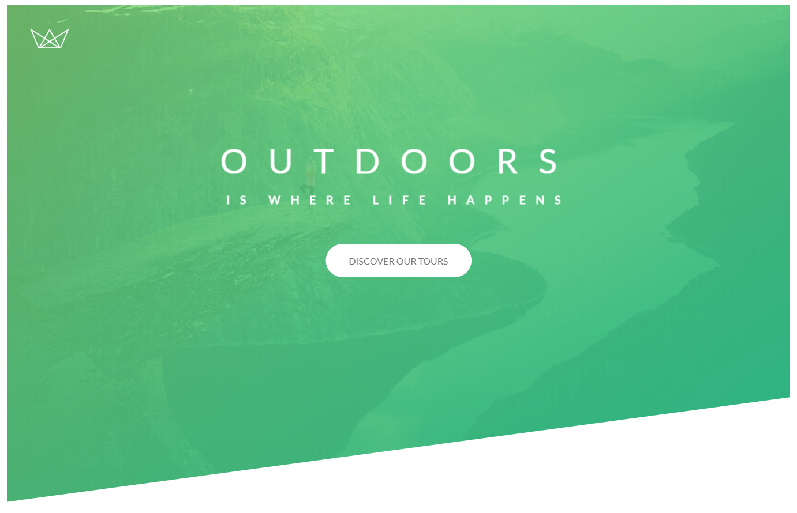

# Natours

This site was created as part of the [Advanced CSS and Sass Course](https://www.udemy.com/course/advanced-css-and-sass) on Udemy.

## Key Features

### Modular

-   Implements the [7-1 Pattern](https://sass-guidelin.es/#the-7-1-pattern) in Sass

### Responsive

-   Fonts are all rem based

### Dynamic

-   Page load animations
-   Custom button animations
